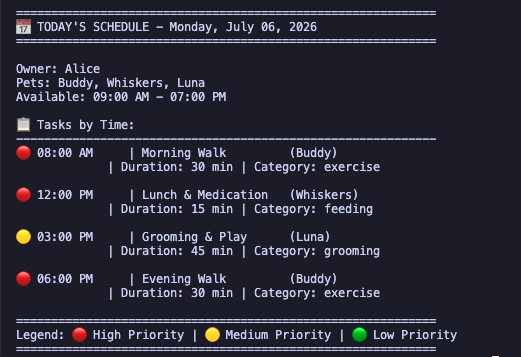
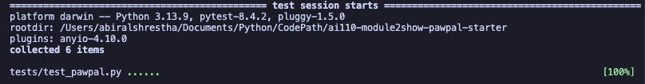

# PawPal+ (Module 2 Project)

You are building **PawPal+**, a Streamlit app that helps a pet owner plan care tasks for their pet.

## Scenario

A busy pet owner needs help staying consistent with pet care. They want an assistant that can:

- Track pet care tasks (walks, feeding, meds, enrichment, grooming, etc.)
- Consider constraints (time available, priority, owner preferences)
- Produce a daily plan and explain why it chose that plan

Your job is to design the system first (UML), then implement the logic in Python, then connect it to the Streamlit UI.

## What you will build

Your final app should:

- Let a user enter basic owner + pet info
- Let a user add/edit tasks (duration + priority at minimum)
- Generate a daily schedule/plan based on constraints and priorities
- Display the plan clearly (and ideally explain the reasoning)
- Include tests for the most important scheduling behaviors

## Getting started

### Setup

```bash
python -m venv .venv
source .venv/bin/activate  # Windows: .venv\Scripts\activate
pip install -r requirements.txt
```

### Suggested workflow

1. Read the scenario carefully and identify requirements and edge cases.
2. Draft a UML diagram (classes, attributes, methods, relationships).
3. Convert UML into Python class stubs (no logic yet).
4. Implement scheduling logic in small increments.
5. Add tests to verify key behaviors.
6. Connect your logic to the Streamlit UI in `app.py`.
7. Refine UML so it matches what you actually built.

## 🖥️ Sample Output

Paste a sample of your app's CLI or Streamlit output here so a reader can see what a generated plan looks like:

```
# e.g.:
# Daily plan for Biscuit (Golden Retriever):
#   08:00 — Morning walk (30 min) [priority: high]
#   09:00 — Feeding (10 min) [priority: high]
#   ...
```



## 🧪 Testing PawPal+

```bash
# Run the full test suite:
pytest

# Run with coverage:
pytest --cov
```

Sample test output:
Confidence Level: 5/5 stars


```
# Paste your pytest output here
```

## 📐 Smarter Scheduling

The scheduling logic now lives in `pawpal_system.py` and is split across a few focused methods:

| Feature           | Method(s)                                                                            | Notes                                                                                                                                                       |
| ----------------- | ------------------------------------------------------------------------------------ | ----------------------------------------------------------------------------------------------------------------------------------------------------------- |
| Task sorting      | `Scheduler.sort_by_time()`                                                           | Sorts tasks by their `HH:MM` time constraint so earlier tasks appear first, even when the input list is out of order.                                       |
| Filtering         | `TaskManager.filter_tasks()`                                                         | Filters tasks by completion status or by pet name, using the owner's pets to match task ownership.                                                          |
| Conflict handling | `Scheduler.detect_conflicts()`                                                       | Checks scheduled task time windows for overlaps and returns human-readable conflict warnings.                                                               |
| Recurring tasks   | `Task.mark_complete()`, `Task.next_occurrence()`, `TaskManager.mark_task_complete()` | Completing a `daily` or `weekly` task creates a new next-occurrence task automatically; daily tasks use `today + 1 day`, weekly tasks use `today + 7 days`. |

These methods are the core of the smarter scheduling behavior used by the terminal demo and Streamlit UI.

## 📸 Demo Walkthrough

Describe your app in numbered steps so a reader can follow along without watching a video:

Use this quick flow to demonstrate the full scheduling pipeline:

1. Enter owner name and available hours (example: `09:00-12:00, 13:00-17:00`).
2. Add one or more pets.
3. Add several tasks with different priorities and durations.
4. Optionally add fixed-time tasks by setting `time_constraint` in backend task objects.
5. Click **Generate Plan**.

Expected demo outcomes:

- A scheduled-task table appears with Task, Pet, Time, Duration, and Priority.
- If overlaps are detected in scheduled windows, warning banners are shown.
- If no overlaps are detected, a success message confirms conflict-free scheduling.
- Tasks that cannot fit into available time appear under the Unscheduled Tasks expander.

Suggested demo dataset:

- Pets: `Mochi (dog)`, `Nori (cat)`
- Tasks:
  - `Morning walk` (30 min, high)
  - `Feed breakfast` (10 min, high)
  - `Medication` (5 min, high)
  - `Training` (45 min, medium)
  - `Playtime` (25 min, low)

**Screenshot or video** _(optional)_: <!-- Insert a screenshot or link to a demo video here -->
